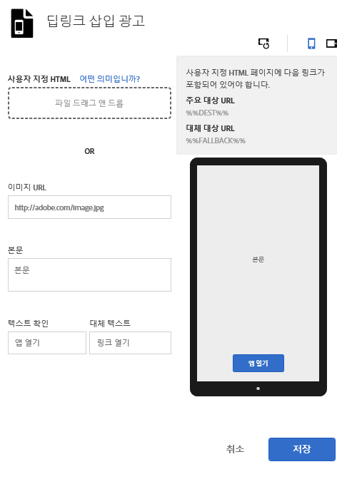

# 중간 광고{#interstitials}

앱(앱 딥링크) 설치 여부에 따라 사용자를 대상(웹 사이트 또는 앱스토어)으로 안내할 수 있습니다. 라우팅 선택은 사용자에게 가장 적합합니다. 마케터는 사용 가능한 랜딩 대상을 보여 주는 중간 페이지를 구성하여 사용자 선택을 제공할 수 있습니다.

마케팅 링크를 만들 때 삽입 광고를 구성하려면 다음을 수행하십시오.

1. **[!UICONTROL 딥링크 삽입 광고 편집]**&#x200B;을 클릭합니다.

   

1. 다음 필드에 정보를 입력하십시오.

   * **[!UICONTROL 사용자 지정 HTML]**

      사용자 지정 광고 삽입 HTML 페이지를 선택합니다.

      마케터는 사용자 지정 삽입 광고를 사용하여 사용자 지정 HTML/CSS/JS로 삽입 광고 방문 페이지를 맞춤 설정하여 페이지를 브랜드화할 수 있습니다.

      다음은 HTML 페이지의 요구 사항입니다.

      * HTML 파일이어야 합니다.
      * `%%DEST%%` 및 `%%FALLBACK%%` 자리 표시자를 포함해야 합니다.
      * 업로드된 HTML은 `<iframe>`으로 제공됩니다.

         링크 대상이 상위 창을 가리키는지 확인해야 합니다. `<base target="_parent" />`에 `<head>`를 포함하거나, 각 `<a/>`에 대한 타겟 속성을 개별적으로 지정할 수 있습니다.

         >[!TIP]
         >
         >사용자 지정 HTML을 업로드하는 경우 업로드된 파일을 제거하지 않으면 이 테이블의 다른 4개 옵션이 사용되지 않습니다.
   * **[!UICONTROL 이미지 URL]**

      이미지 자산 URL을 지정합니다.

   * **[!UICONTROL 본문]**

      삽입 광고 본문을 지정합니다.

   * **[!UICONTROL 텍스트 확인]**

      텍스트 단추의 텍스트를 지정합니다.

   * **[!UICONTROL 대체 텍스트]**

      표시할 대체 텍스트를 지정합니다.

      이 필드는 딥 링크에 실패하면 텍스트 단추를 업데이트합니다. 사용자는 다른 대체 옵션으로 이동하기 전에 먼저 딥링크 연결을 시도하도록 안내됩니다. 예를 들어 앱을 다운로드 및 설치하거나 사용자를 회사 웹 사이트로 안내하기 위해 앱 스토어로 폴백이 될 수 있습니다. 대체 텍스트를 사용하면 사용자가 딥링크 연결에 실패하는 경우 사용할 수 있는 다른 옵션이 있음을 알 수 있습니다.

1. (**선택사항**) 이미지 위의 아이콘을 클릭하면 삽입 광고가 다른 장치에서 회전된 것처럼 보이는 방식을 알 수 있습니다.

   이미지가 다른 상황에서 제대로 표시되는지 확인하기 위해 Mobile Services 밖에서 이미지를 변경하거나 편집할 수 있습니다.
1. **[!UICONTROL 저장]**&#x200B;을 클릭합니다.
