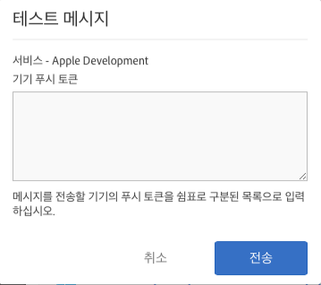

# 푸시 메시지를 활성화하기 위한 전제 조건 {#prerequisites-to-enable-push-messaging}

애플리케이션에서 푸시 메시지를 구성하려면 다음 작업을 완료해야 합니다.

## 회사에 대해 Experience Cloud 활성화

Adobe Analytics를 사용하는 회사에서는 Experience Cloud가 활성화되어 있어야 합니다. Adobe 계정 담당자에게 상태를 확인할 수 있습니다.

## 모바일 SDK 설치 및 구성

* **Mobile SDK 설치**

   푸시 메시지를 구성하려면 모바일 SDK 버전 4.6 이상을 다운로드하여 설치해야 합니다. 자세한 내용은 [SDK 다운로드](/help/using/c-manage-app-settings/c-mob-confg-app/t-config-analytics/download-sdk.md)를 참조하십시오.

* **푸시 서비스 구성**

   Mobile SDK에서 푸시 서비스를 구성해야 합니다.
자세한 정보는 다음 내용을 참조하십시오.

   * [Android의 푸시 메시지](/help/android/messaging-main/push-messaging/push-messaging.md)
   * [iOS의 푸시 메시지](/help/ios/messaging-main/push-messaging/push-messaging.md)

## Adobe ID를 사용하여 Mobile 핵심 서비스에 로그인합니다

>[!IMPORTANT]
>
>푸시 서비스 기능을 사용하려면, 사용자가 자신의 Adobe ID를 사용하여 Mobile Core 서비스에 로그인하여 해당 Analytics 계정이 Adobe ID에 연결되어 있어야 합니다. 사용자가 기존 Adobe Analytics 계정을 사용하여 로그인하는 경우에는 푸시 서비스 기능을 사용할 수 없습니다.

사용자에게 Adobe ID가 없는 경우 다음 단계를 완료하십시오.

1. (**Experience Cloud 관리자**) 사용자를 Experience Cloud에 초대합니다.

1. (**사용자**) Experience Cloud 관리자로부터 받은 지침을 사용하여 개인 Adobe ID를 만듭니다.

   이메일 메시지는 관리자가 이전 단계를 완료한 후 각 사용자에게 자동으로 전송됩니다.

1. (**사용자**) 자신의 Adobe ID를 사용하여 Mobile에 로그인합니다.

## Experience Cloud에서 사용자 계정 연결

각 사용자는 Experience Cloud 조직의 Analytics 솔루션 계정을 연결해야 합니다.

1. Adobe ID로 Experience Cloud에 로그인하려면 브라우저에 https://marketing.adobe.com을 입력합니다.

1. 오른쪽 상단 모서리에서 Analytics 회사 이름을 선택합니다.

1. **[!UICONTROL 조직 추가]**&#x200B;를 클릭한 다음, 드롭다운 목록에서 **[!UICONTROL Adobe SiteCatalyst/Adobe Social을 선택합니다.]**

1. 회사 이름, 즉 지정된 회사의 레거시 자격 증명을 입력하고 **[!UICONTROL 계정 연결을 클릭합니다]**.

   이제 Adobe ID가 Analytics 계정, 회사 및 로그인 자격 증명에 연결됩니다.

자세한 내용은 [계정 연결 문제 해결](https://docs.adobe.com/content/help/ko-KR/core-services/interface/manage-users-and-products/organizations.html)을 참조하십시오.

## 모바일 사용자 인터페이스에서 푸시 서비스 및 SDK ID 서비스 구성

앱에 대해 ID 서비스를 활성화하기 전에는 **[!UICONTROL 푸시 서비스]** 섹션이 비활성화되어 있습니다. 그러나 ID 서비스를 활성화하면 푸시 서비스 섹션이 활성화됩니다. 푸시 서비스 활성화에 대한 자세한 내용은 [SDK ID 서비스 옵션 구성](/help/using/c-manage-app-settings/c-mob-confg-app/t-config-visitor.md)을 참조하십시오.

>[!IMPORTANT]: 변경 사항을 저장하고 푸시 서비스를 새로 고치려면 **[!UICONTROL 저장]**&#x200B;을 클릭해야 합니다.
>
>각 보고서 세트에서 Apple용 앱스토어 앱과 Google용 앱을 각각 구성할 수 있습니다. 예를 들어 제작 환경용 앱과 개발 환경용 앱이 추가로 필요한 경우 각각의 환경에 대해 새 앱스토어 앱과 새 보고서 세트를 설정합니다.

* Apple **의**&#x200B;경우 개인 키 및/또는 인증서를 드래그 앤 드롭합니다. 개인 키가 암호로 암호화되어 있으면 암호를 입력합니다.

   * **개인 키**&#x200B;에 대해 개인 키 파일을 상자로 드래그하여 놓습니다.

      **[!UICONTROL 찾아보기]**&#x200B;를 클릭하여 파일을 선택할 수도 있습니다. 이 파일에는 개인 키가 들어 있습니다. 이 파일(`.p12`, `pkcs12`, `.pfx`, `.key`, `.pem`)에 인증서가 포함되어 있을 수 있습니다.

   * 개인 **키 암호**(개인 키 파일)의 경우 암호를 입력합니다.

      (조건부) **인증서의**&#x200B;경우 인증서 파일을 상자로 드래그하여 놓습니다. **[!UICONTROL 찾아보기]**&#x200B;를 클릭하여 파일을 선택할 수도 있습니다. 개인 키 파일에 인증서(`.cert`, `.cer`, `.crt`. `.pem`)도 포함되어 있는 경우에는 이 필드가 필요하지 않습니다.

* **Google**&#x200B;에 대해 앱용 API 키를 지정합니다.

   **[!UICONTROL 테스트]**&#x200B;를 클릭하여 앱 및 Mobile Services가 올바르게 구성되어 있는지 확인합니다. 이 옵션은 디버깅 및 문제 해결에 유용합니다.

   메시지를 보낼 장치의 푸시 토큰을 입력합니다. 토큰을 쉼표로 구분된 목록으로 지정하면 메시지를 여러 장치에 보낼 수 있습니다.

   
