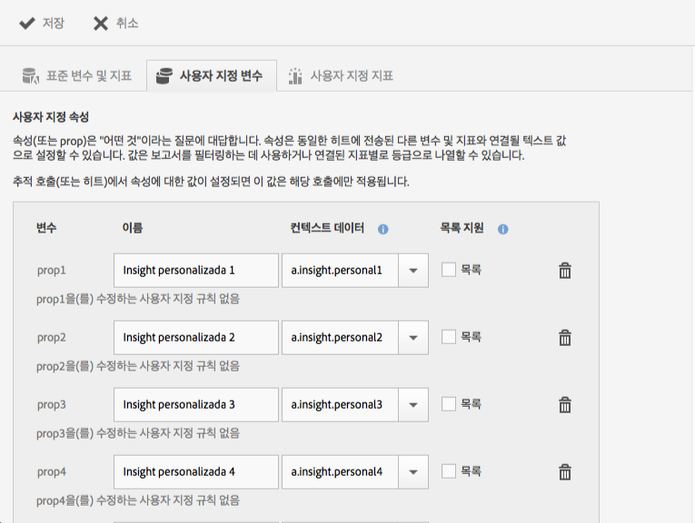
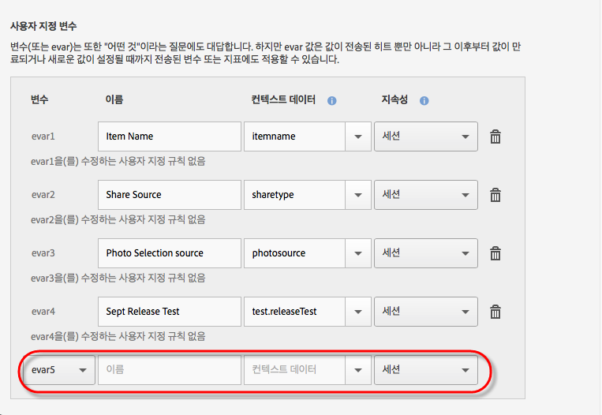

# 앱 관리 {#managing-your-app}

다양한 변수 및 지표를 구성하여 앱에서 받은 데이터를 추적하고 관리할 수 있습니다.

## 변수 및 지표 관리 {#section_EC2D58AC334F4ED49E764B81C2423A62}

* **표준 변수 및 지표**

   각 앱에는 장바구니와 구매 활동을 추적하기 위한 변수와 지표가 포함되어 있습니다. 일부 구매 정보는 처리 규칙으로 처리할 수 없기 때문에 SDK는 특정 `"&&products"` 컨텍스트 데이터를 노출시킵니다. 예를 들어 장바구니 추가, 장바구니 제거, 체크아웃, 주문 등과 같은 변수가 있을 수 있습니다. 컨텍스트 데이터는 Adobe Analytics의 데이터에 매핑해야 합니다. 이 변수가 컨텍스트 데이터의 간단한 매핑으로 채워지는 경우 컨텍스트 데이터는 변수를 매핑하는 키입니다. 이 변수가 Analytics 관리 도구의 더 복잡한 규칙으로 채워지는 경우에는 이 필드를 비워 두십시오.

   이러한 변수 및 지표에 대한 자세한 내용은 다음을 참조하십시오.

   * [Android의 제품 변수](/help/android/analytics-main/products/products.md)
   * [iOS의 제품 변수](/help/ios/analytics-main/products/products.md)

* **사용자 지정 변수**

   사용자 지정 변수 페이지에는 앱 데이터를 포함하는 보고서 세트에 대해 구성된 모든 사용자 지정 Analytics 변수가 모두 표시됩니다. 이 페이지에서 추가적인 변수를 사용할 수 있도록 설정하고, 컨텍스트 데이터를 Analytics 변수에 매핑할 수 있습니다.

### 컨텍스트 데이터를 Analytics 변수에 매핑

**[!UICONTROL 앱 설정 관리]** > **[!UICONTROL 변수 및 지표 관리]** > **[!UICONTROL 사용자 지정 변수]**&#x200B;를 클릭합니다.

이러한 매핑 시 [처리 규칙](https://docs.adobe.com/content/help/ko-KR/analytics/admin/admin-tools/processing-rules/processing-rules.html)에 사용된 동일한 API를 호출합니다.

다음은 구성할 수 있는 사용자 지정 변수 목록입니다.

* **[!UICONTROL 사용자 지정 속성]**(또는 props)은 &quot;어느 것?&quot;이라는 질문에 답합니다. 속성(또는 Prop)은 동일한 히트에서 전송된 다른 변수 및 지표와 연관될 텍스트 값으로 설정할 수 있습니다. 이 값을 사용하여 보고서를 필터링하거나 관련 지표에 따라 등급 순서대로 나열할 수 있습니다.

   추적 호출(또는 히트)에서 속성 값을 설정하면 해당 호출에만 적용됩니다.

* **[!UICONTROL 사용자 지정 변수]**(또는 evars)도 &quot;어느 것?&quot;이라는 질문에 답합니다. 하지만 evar 값은 값이 만료되거나 새로운 값이 설정되기 전까지 전송된 히트만이 아니라 다음 히트에 전송되는 변수 및 지표에도 적용될 수 있습니다.
* **[!UICONTROL 사용자 지정 목록 변수(또는 복수 값 변수)]**&#x200B;는 한 번의 히트에 대해 여러 값을 캡처할 수 있도록 허용된 경우를 제외하면 일반 변수와 동일하게 동작합니다. 자세한 내용은 [목록 변수](https://docs.adobe.com/content/help/ko-KR/analytics/implementation/javascript-implementation/variables-analytics-reporting/page-variables.html)를 참조하십시오.

다음 매핑은 Mobile Services에서 만들어져서 Analytics에 표시됩니다.

* **[!UICONTROL 이름]**

   데이터 컬렉션 변수의 친숙한 이름입니다.

* **[!UICONTROL 컨텍스트 데이터]**

   이 변수가 컨텍스트 데이터의 간단한 매핑으로 채워지는 경우 컨텍스트 데이터는 변수를 매핑하는 키입니다. 이 변수가 Analytics 관리 도구의 더 복잡한 규칙으로 채워지는 경우에는 이 필드를 비워 두십시오.

   컨텍스트 데이터 열을 클릭하고 매핑할 컨텍스트 데이터 변수를 선택합니다. 드롭다운 목록에는 지난 30일 동안 수신한 변수가 포함되어 있으므로 매핑할 컨텍스트 데이터가 목록에 없으면 입력하면 됩니다.

* **[!UICONTROL 지속성(사용자 지정 변수 및 사용자 지정 목록 변수)]**

   지속성은 사용자 지정 변수(eVar) 값이 만료되거나 더 이상 추가 히트와 연결되지 않는 지점을 결정합니다. 히트가 실행될 때 eVar가 만료된 경우 없음 값이 해당 eVar에 대한 해당 히트와 연결됩니다. 즉, 히트가 실행되었을 때 활성 eVar 값이 없음을 의미합니다.

   다음 옵션 중 하나를 선택할 수 있습니다.

   * **[!UICONTROL Session]**

      eVar 값은 Analytics 방문 시간 동안 지속됩니다.

   * **[!UICONTROL 추적 호출]**

      eVar 값은 추적 호출에 대해서만 지속되거나, 포함된 추적 호출을 조회합니다.

   * **[!UICONTROL 만료 기간 제한 없음]**

      eVar 값은 모든 후속 추적 호출 동안 지속됩니다.
   * **[!UICONTROL 고급]**

      Adobe Analytics에는 eVars의 지속성 설정에 대한 고급 UI가 있습니다. Mobile Services에서 지원되지 않는 eVar에 대해 지속성 값을 설정하면 이 값이 Mobile Services UI에 표시됩니다.

      eVars를 관리하려면 **[!UICONTROL Adobe Analytics 보고서 세트 관리자]** > **[!UICONTROL 전환 변수 UI]**&#x200B;를 클릭합니다.

   * **[!UICONTROL 목록 지원]**

      단일 추적 호출에서 속성과 연결할 복수 값을 전달할 수 있도록 합니다. 구분 기호는 단일 문자여야 하며 0이나 공백이 될 수 없습니다.

   * **[!UICONTROL 구분 기호]**

      구분 기호는 단일 문자여야 하며 0이나 공백이 될 수 없습니다.

### 추가 Analytics 변수

각 변수 섹션의 맨 아래에서 드롭다운 목록을 사용하여 추가 변수를 사용하도록 설정할 수 있습니다.

사용하지 않은 변수 번호를 선택하고 이름을 입력합니다. 필요한 경우 저장할 컨텍스트 데이터 변수와 추가 정보를 제공할 수 있습니다.

* **사용자 지정 지표**

   지표(또는 이벤트)는 *얼마나?* 또는 *몇 개나?* 질문에 답합니다. 사용자가 작업을 수행하거나 가격 등의 숫자 값을 보유할 때마다 이벤트가 증가할 수 있습니다. 사용자 지정 지표에는 앱 생성, PDF 또는 CSV 파일 다운로드 또는 내보내기, 캠페인 저장, SKD 다운로드, 보고서 실행, App Store에 대한 링크 추가, 인앱 메시지 활성화 등의 이벤트가 포함됩니다.

   다음 사용자 지정 지표 유형 중 하나를 선택합니다.

   * **[!UICONTROL 전체 번호]**
   * **[!UICONTROL 십진수]**
   * **[!UICONTROL 통화]**

## 관심 영역 관리{#section_990EF15E4E3B42CC807FCD9BEC8DB4C6}

관심 영역을 사용하여 상관 관계 목적으로 사용하고, 인앱 메시지로 타깃팅하는 등의 작업을 수행할 수 있는 지리적 위치를 정의할 수 있습니다. 히트가 관심 영역으로 전송되는 경우 관심 영역이 히트에 연결됩니다. 관심 영역에 대한 자세한 내용은 [관심 영역 관리](/help/using/location/t-manage-points.md)를 참조하십시오.

## 링크 대상 관리{#section_F722A387E22A430187B063D358A87711}

링크 대상을 작성, 편집, 보관/보관 해제 및 삭제할 수 있습니다. 이러한 대상을 만들면 마케팅 링크, 푸시 알림 또는 인앱 메시지를 작성할 때 인라인으로 호출할 수 있습니다. 링크 대상에 대한 자세한 내용은 [링크 대상 관리](/help/using/acquisition-main/c-manage-link-destinations/t-archive-unarchive-link-destinations.md)를 참조하십시오.

## 포스트백 관리 {#section_78B0A8D7AE6940E78D85AE3AB829E860}

포스트백을 이용하면 Adobe Mobile로 수집한 데이터를 별도의 타사 서버에 보낼 수 있습니다. 인앱 메시지를 표시하는 데 사용하는 것과 동일한 트리거와 트레이트를 이용하면 사용자 지정된 데이터를 타사 대상에 보내도록 Mobile을 구성할 수 있습니다. 포스트백에 대한 자세한 내용은 [포스트백 구성](/help/using/c-manage-app-settings/c-mob-confg-app/signals.md)을 참조하십시오.
