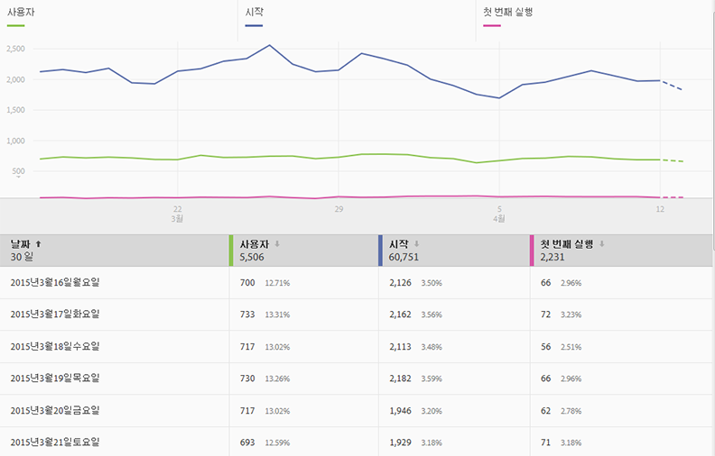
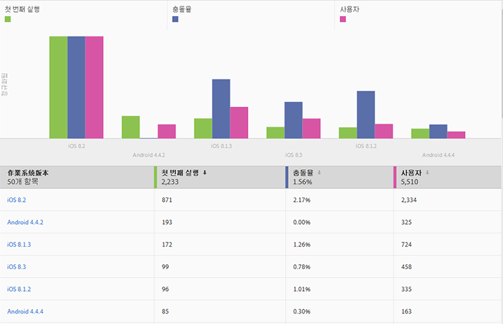
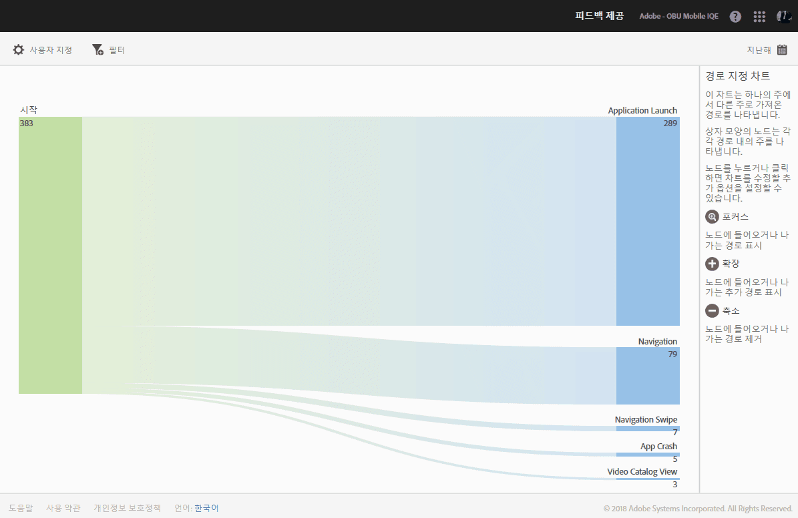
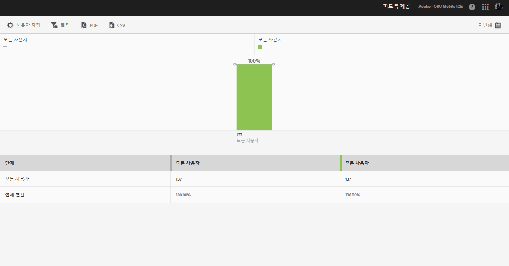

# 보고서 유형 {#report-types}

보고서를 사용자 지정할 때, 높은 유연성은 필요한 데이터를 얻기 위해 가장 적절한 보고서 유형에 대해 몇 가지 질문을 초래할 수 있습니다.

보고서를 사용자 지정하기 전에 지표와 차원의 차이점을 이해해야 합니다.

* 지표

   지표는 데이터를 측정하는 데 사용됩니다. 지표는 계산 및 추가할 수 있는 값이며 앱에서 특정 작업이 발생하는 빈도를 확인하는 데 사용됩니다. 일반적인 지표에는 설치, 실행, 매출, 라이프타임 값 및 로그인이 포함됩니다. 예를 들어 앱을 실행할 때마다 _launches_value가 하나씩 증가합니다.

* 차원

   차원은 데이터를 묘사하는 데 사용됩니다. 차원은 문자열이나, 문자열처럼 동작하는 숫자(예: 우편 번호)를 사용하여 나타내며, 데이터를 구성하고 세그먼트화하는 데 사용됩니다. 일반적인 차원의 예로는 OS 버전, 캠페인 이름, 제품 이름 및 이동통신사가 있습니다. 각 차원에는 해당 차원과 연결된 여러 개의 특정 값이 있습니다. 예를 들어 OS 버전 차원에는 _iOS 7_ 및 _Android 4.1.2_&#x200B;와 같은 값이 있습니다.

다음은 Mobile UI에서 생성할 수 있는 보고서 유형입니다.

## 기간 보고서 {#section_2741DA54C90C49AFB17C7B9BC7AD627D}

기간 보고서는 스파이크와 트렌드를 신속히 식별할 수 있도록 시간 범위 동안 지표가 수행되는 방법을 보여 줍니다. 분석은 종종 기간 보고서에서 시작되고, 지표 스파이크나 트렌드에 영향을 줄 수 있는 요인을 조사하도록 드릴다운할 때 트렌드 및 등급 보고서로 이동합니다. 

예를 들어, 시작 중 스파이크가 표시되면, 상위 5개 운영 체제에 대한 시작을 보여주는 트렌드 보고서를 실행하여 어느 운영 체제가 시작 스파이크에 가장 많이 기여하고 있는지 확인할 수 있습니다.

시간 보고서에서 다른 지표와 함께 차원 값을 보려면 인스턴스 지표를 사용하고 차원 필터를 정의하면 됩니다.

## 트렌드 보고서 {#section_C9BE9A2EDBFF4D938B9AF14C8AA67883}

트렌드 보고서는 지표에 대해 가장 인기 있는 차원이 어떻게 작동하는지 확인하는 데 도움이 됩니다. 이 보고서를 사용하여 지표 변경에 가장 많이 기여하는 값을 결정할 수 있습니다.

차원의 트렌드 보고서를 보려면 고정 필터(예: 운영 체제 = iOS 6.0.1)를 기간 보고서에 추가하여 동일한 데이터를 봅니다. 보너스로, 필터링된 기간 보고서에 5개의 지표를 더 추가할 수 있습니다.

## 필터링된 기간 보고서 {#section_F8FAF2A4496F449CA99EF1E052C71A2D}

확인할 특정 차원 값이 있는 경우 기간 보고서에 고정 필터를 추가할 수 있습니다. 다음 보고서는 특정 운영 체제 버전에 대한 30일 동안의 시작, 업그레이드 및 충돌을 보여줍니다.

## 등급 보고서 {#section_C073D744A95843AF99EE74FB5B013735}

등급 보고서는 상위 50개 차원이 지표에 기여하는 빈도를 보여줍니다. 이 보고서는 많은 값의 날짜 범위에 대한 전체 기여도를 보는 데 유용합니다.

## Sunburst 보고서 {#section_17A9842039174DE094A6B1E9837E35BB}

선버스트 보고서에서는 예를 들어 분류와 함께 기본 보고서를 제공합니다. 시각화는 높이를 사용하여 지표와 지표 간의 성능 차이를 표시합니다. 각 동심원은 해당 원의 카테고리에서 대상 세그먼트를 나타냅니다. 고정 필터 적용, 지표 숨기기, 지표 보기 등 대상에 대한 작업을 수행할 수 있습니다.

Sunburst 차트와 상호 작용하는 방법을 설명하는 제품 내 자습서와 보고서를 볼 수 있습니다.

자습서를 시작하려면 다음을 수행하십시오.

1. 앱 설정 관리에서 **[!UICONTROL 사용]**&#x200B;을 클릭합니다.

1. **[!UICONTROL 기술]** > **[!UICONTROL 기술 분류]**&#x200B;를 클릭합니다.
1. 보고서의 제목 표시줄에서 **[!UICONTROL 사용자 지정]**&#x200B;을 클릭하고 정보 아이콘을 클릭합니다.

### 경로 지정 보고서 {#section_AD400106BC684B50B27CCCD3F4497114}

경로 지정 보고서는 경로 분석을 기반으로 하며 앱의 한 상태에서 다른 상태로 이동하는 경로를 나타내는 경로 지정 차트를 표시합니다.

상자 모양의 각 노드는 앱에서 사용자 경로에 있는 상태를 나타냅니다. 예를 들어, 위의 그림에서 맨 위 노드는 앱을 시작하고 갤러리에서 사진을 선택한 사용자의 수를 나타냅니다.

### 단계 보고서 {#section_AF3B0C899D844FC3AD1F91A2C452C92F}

단계 보고서를 사용하면 고객이 마케팅 캠페인을 포기하는 상황이나 모바일 앱과 상호 작용할 때 정의된 전환 경로를 벗어나는 상황을 식별할 수 있습니다. 단계 보고서를 사용하여 서로 다른 세그먼트의 작업을 비교할 수도 있습니다.

단계 시각화를 사용하면 고객이 프로세스에서 이탈한 위치를 확인할 수 있습니다. 각 단계에서 고객의 결정을 시각화하면 고객이 단념하는 상황, 고객이 잘 따르는 경로, 고객이 앱을 나가는 시점을 이해할 수 있습니다.

