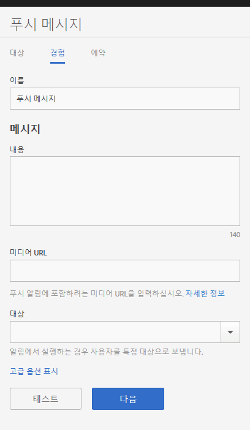

# 환경: 푸시 메시지 {#experience-push-message}

이름, 메시지 텍스트 및 대상 옵션을 비롯한 푸시 메시지 및 리치 푸시 메시지에 대한 경험 옵션을 구성할 수 있습니다. iOS 장치에 대한 페이로드 옵션 및 사용자 정의 옵션을 비롯한 고급 옵션을 구성할 수도 있습니다.

1. 새 푸시 메시지에 대한 대상 페이지에서 **[!UICONTROL 환경]**&#x200B;을 클릭합니다.

   

1. 이 메시지의 이름을 입력합니다.
1. **[!UICONTROL 메시지]** 섹션의 다음 필드에 정보를 입력합니다.

   * **[!UICONTROL 컨텐츠]**

      메시지 텍스트를 지정합니다. 최대 140자를 지정할 수 있습니다.

   * **[!UICONTROL 미디어 URL]**

      푸시 알림 메시지에서 사용할 미디어 파일의 URL을 입력합니다. 리치 푸시 알림을 사용하기 위한 요구 사항은 아래의 *리치 푸시 알림에 대한 요구 사항*&#x200B;을 참조하십시오.

      >[!IMPORTANT]
      >
      >푸시 알림에 이미지 또는 비디오를 표시하려면 다음 사항을 기억하십시오.
      > * `attachment-url` 데이터는 푸시 페이로드에서 처리됩니다.
      > * 미디어 URL은 스파이크 요청을 처리할 수 있어야 합니다.

   * **[!UICONTROL 대상]**

      사용자가 메시지를 클릭스루한 경우 보낼 특정 대상(예: 웹 링크, 딥링크 또는 하이브리드 링크)을 선택합니다. 자세한 내용은 [대상](/help/using/acquisition-main/c-create-destinations.md)을 참조하십시오.

      >[!TIP]
      >
      >* **[!UICONTROL 웹 링크]** 또는 **[!UICONTROL 사용자 지정 링크]** 대상 유형을 사용하는 경우 대상 유형이 추적되지 않습니다. **[!UICONTROL 딥링크]**&#x200B;만 추적됩니다.

## 리치 푸시 알림에 대한 요구 사항

다음은 리치 푸시 알림을 전송하기 위한 요구 사항입니다.

* **지원되는 버전**

   리치 푸시 알림은 다음 버전에서 지원됩니다.
   * Android 4.1.0 이상
   * iOS 10 이상

      >[!IMPORTANT]
      >
      >다음 정보를 숙지하십시오.
      >* 이전 버전으로 보낸 리치 푸시 메시지는 전송은 되지만 텍스트만 표시됩니다.
      >* 현재 보기 지원은 없습니다.

* **파일 형식**

   다음은 지원되는 파일 형식입니다.
   * 이미지: JPG 및 PNG
   * 애니메이션(iOS만 해당): GIF
   * 비디오(iOS만 해당): MP4

* **URL 형식**
   * HTTPS만 해당

* **크기 조정**
   * 이미지는 2:1 형식이어야 합니다. 그렇지 않으면 이미지가 잘립니다.

리치 푸시 알림 구성에 대한 자세한 내용은 다음 내용을 참조하십시오.

* [Android에서 푸시 알림 받기](/help/android/messaging-main/push-messaging/c-set-up-rich-push-notif-android.md)
* [iOS에서 푸시 알림 받기](/help/ios/messaging-main/push-messaging/c-set-up-rich-push-notif-ios.md)

환경 페이지에서 푸시 메시지를 구성하려면 다음을 수행하십시오.

1. (**선택사항**) 추가 옵션을 구성하려면 **[!UICONTROL 고급 옵션 표시]** 링크를 클릭합니다.

   * **[!UICONTROL 페이로드: 데이터]**

      푸시 또는 로컬 알림을 통해 앱으로 전송되는 JSON의 사용자 지정 푸시 페이로드를 제공합니다. Android 및 iOS의 제한은 4KB입니다.

   * **[!UICONTROL Apple에만 해당하는 옵션: 범주]**

      푸시 및 로컬 알림에 대한 범주를 제공합니다. 자세한 내용은 *iOS 개발자 라이브러리*&#x200B;에서 [앱의 알림 지원 관리](https://developer.apple.com/library/content/documentation/NetworkingInternet/Conceptual/RemoteNotificationsPG/SupportingNotificationsinYourApp.html#//apple_ref/doc/uid/TP40008194-CH4-SW9)를 참조하십시오.

   * **[!UICONTROL Apple 옵션: 사운드]**

      재생할 앱 번들 내 사운드 파일의 이름을 입력합니다. 설정하지 않을 경우 기본 경고 사운드가 재생됩니다. 자세한 내용은 *iOS 개발자 라이브러리*&#x200B;에서 [앱의 알림 지원 관리](https://developer.apple.com/library/content/documentation/NetworkingInternet/Conceptual/RemoteNotificationsPG/SupportingNotificationsinYourApp.html#//apple_ref/doc/uid/TP40008194-CH4-SW10)를 참조하십시오.

   * **[!UICONTROL Apple 옵션: 컨텐츠 이용 가능]**

      이 옵션을 선택하면 메시지가 도착할 때 iOS가 백그라운드에 있는 앱을 깨워 앱에서 메시지 페이로드를 바탕으로 코드를 실행하게 됩니다. 자세한 내용은 [iOS 개발자 라이브러리](https://developer.apple.com/library/content/documentation/NetworkingInternet/Conceptual/RemoteNotificationsPG/APNSOverview.html#//apple_ref/doc/uid/TP40008194-CH8-SW1)의 *Apple 푸시 알림 서비스*&#x200B;를 참조하십시오.

1. (선택 사항) 다음 아이콘을 클릭하여 메시지 레이아웃을 미리 보기합니다.

   * **[!UICONTROL x 요약]**

      미리 보기 창을 숨깁니다. 미리 보기 창을 다시 표시하려면 를 클릭합니다.

   * **[!UICONTROL 방향 변경]**

      미리 보기 방향을 세로에서 가로 모드로 변경하려면 을 클릭합니다. 시계의 경우, 방향이 둥근 시계 면에서 사각 시계 면으로 변합니다.

   * **[!UICONTROL 사용자의 시계에서 미리 보기]**

      사용자의 시계에 표시되는 메시지를 미리 보려면 을 클릭합니다.

   * **[!UICONTROL 사용자의 휴대폰에서 미리 보기]**

      사용자의 휴대폰에 표시되는 메시지를 미리 보려면 을 클릭합니다.

   * **[!UICONTROL 사용자의 태블릿에서 미리 보기]**

      사용자의 태블릿에서 메시지를 미리 보려면 을 클릭합니다.
   미리 보기 패널의 맨 아래에서, 이전 단계에서 선택한 대상에 대한 설명을 볼 수 있습니다.

1. (**선택사항**) 테스트 목적으로 지정된 장치에 메시지를 푸시하려면 **[!UICONTROL 테스트]**&#x200B;를 클릭합니다.
1. 서비스를 선택하고 메시지를 푸시할 하나 이상의 장치에 대한 푸시 토큰을 입력합니다.

   메시지를 두 개 이상의 장치에 푸시하려면 토큰을 쉼표로 구분된 목록으로 지정합니다.

1. 메시지의 예약 옵션을 구성합니다.

   자세한 내용은 [예약: 푸시 메시지](/help/using/in-app-messaging/t-create-push-message/c-schedule-push-message.md)를 참조하십시오.
