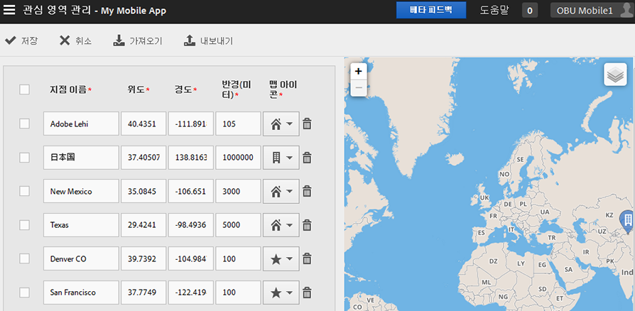

# Manage points of interest {#manage-points-of-interest}

상관 관계 용도로 사용할 수 있고 인앱 메시지로 타깃팅하는 등 지리적 위치를 정의할 수 있는 창을 만들고 관리할 수 있습니다. 히트가 POI로 전송되면 히트에 POI가 연결됩니다.

위치를 사용하려면 먼저 다음 요구 사항을 확인하십시오.

* Analytics—Mobile Apps 또는 Analytics Premium이 있어야 합니다.
* 앱에 대해 **[!UICONTROL 위치 보고서]를 활성화해야 합니다.**
* If you are using a version of the iOS SDK or Android SDK older than version 4.2, after adding new **[!UICONTROL Points of Interest]**, you must download a new configuration file and give it to your app developers.

   If you are using the iOS SDK or Android SDK version 4.2 or later, you do not need to submit an app update to the store to update your **[!UICONTROL Points of Interest]**. 관심 영역 관리 페이지에서 **[!UICONTROL 저장을]**&#x200B;클릭하면 변경 사항이 관심 **[!UICONTROL 영역]** 목록에 패키징되고 라이브 앱에 대한 구성 파일이 업데이트됩니다. 앱이 업데이트된 SDK와 원격 POI URL 이 있는 구성을 사용하는 한, 저장은 또한 사용자 장치에서 앱의 지점 목록을 업데이트합니다.

On the user's device, for a hit to be assigned to a **[!UICONTROL Points of Interest]**, location must be enabled for the app.

위치를 사용하려면 다음 작업을 완료하십시오.

1. 앱 이름을 클릭하여 해당 앱 설정 관리 페이지로 이동합니다.
1. **[!UICONTROL 위치]** &gt; 관심 영역 **[!UICONTROL 관리를]**&#x200B;클릭합니다.

   

1. 다음 각 필드에 정보를 입력합니다.

   * **[!UICONTROL 지점 이름]**

      **[!UICONTROL 지점]이름을 입력합니다.**

      이 이름은 도시, 국가 또는 지역일 수 있습니다. 경기장이나 사업체와 같은 특정 위치 주변에 **[!UICONTROL 지점]을 만들 수도 있습니다.**

   * **[!UICONTROL 위도]**

      **[!UICONTROL 지점의 위도를 입력합니다]**. 이 정보는 인터넷을 포함한 다른 소스에서 찾을 수 있습니다.

   * **[!UICONTROL 경도]**

      **[!UICONTROL 지점의 경도를 입력합니다]**. 이 정보는 인터넷을 포함한 다른 소스에서 찾을 수 있습니다.

   * **[!UICONTROL 반경(미터)]**

      포함할 **[!UICONTROL 지점]주변 반경(미터 단위)을 입력합니다.** 예를 들어, Colorado, Colorado에 대한 POI를 만드는 경우 Denver 시와 주위 지역을 포함할 만큼 충분히 큰 반경을 지정하고 Colorado Springs를 제외할 수 있습니다.

   * **[!UICONTROL 맵 아이콘]**

      [개요](/help/using/location/c-location-overview.md) 및 [맵](/help/using/location/c-map-points.md) 보고서에 표시할 아이콘을 선택합니다.

1. 필요에 따라 다른 POIS를 추가합니다.

   Pois를 5,000 개 이하로 추가하는 것이 좋습니다. 5,000개 이상을 추가하는 경우, 지점을 저장할 수는 있지만, 우수 사례에 5,000개 이하의 영역을 추가하라고 언급되어 있다는 경고 메시지가 표시됩니다.

1. **[!UICONTROL 저장]**&#x200B;을 클릭합니다.

To delete one or more POIs, select the applicable check boxes, and click **[!UICONTROL Remove Selected]**.

Click **[!UICONTROL Import]** or **[!UICONTROL Export]** to work with the data by using a `.csv` file instead of using the Adobe Mobile user interface.
