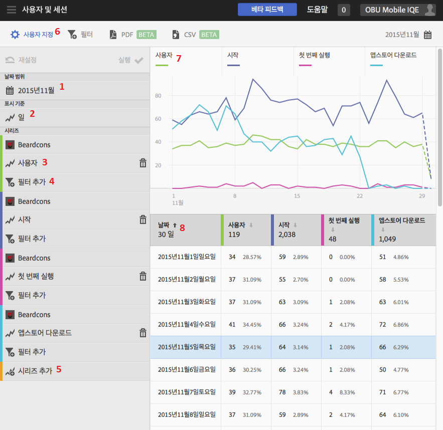

# 보고서 사용자 지정{#customize-reports}

이 정보는 기본 보고서를 이해하고 사용자 지정하는 데 도움이 됩니다.

날짜 범위, **[!UICONTROL 표시 기준]** 옵션(기간이나 차원별로 그래프 및 표 데이터 표시)을 변경하여 보고서를 사용자 지정하고, 지표 및 필터를 추가하고, 추가 시리즈(지표)를 추가하는 등의 작업을 수행할 수 있습니다.

사용자 지정 레일을 표시하려면 앱의 이름을 클릭하여 해당 개요 페이지로 이동한 다음, **[!UICONTROL 사용자 지정]**&#x200B;을 클릭합니다.

다음 예는 [사용자 지정] 레일이 열려 있는 사용자 및 세션 보고서를 보여줍니다. **** 이 예는 일별로 표시된 최근 30일 동안의 데이터를 네 개의 활성 시리즈로 표시합니다.

* **[!UICONTROL 사용자]**
* **[!UICONTROL 시작]**
* **[!UICONTROL 첫 번째 실행]**
* **[!UICONTROL 앱스토어 다운로드]**

다음 정보는 보고서의 각 영역과 **[!UICONTROL 사용자 지정]** 레일에 대해 설명합니다.

| 숫자 | 설명 |
|--- |--- |
| 1 | **[!UICONTROL 날짜 범위]**&#x200B;의 드롭다운 목록에서 보고서에 대한 다양한 날짜 범위를 선택할 수 있습니다. 차트(9)와 해당 표(10)의 모든 데이터는 선택한 날짜 범위를 따릅니다. |
| 2 | **[!UICONTROL 표시 기준]**&#x200B;의 드롭다운 목록에서 보고서에 대한 시간 기반 또는 차원 기반 표시를 선택할 수 있습니다. 예를 들어, 그림에서 일 수가 선택되어 있는 것을 알 수 있습니다. 차트(7) 아래의 날짜와 표(8)에 있는 행을 보면, 데이터 가 기간 보고서에 있는 날짜별로 분류되어 있습니다. 기간 보고서에는 보고서에 시리즈를 더 추가하여 최대 6개의 지표를 보고할 수 있습니다.  라이프사이클 차원을 선택하면 등급 목록의 상위 50개 값, 일별 또는 주별 상위 5개 값, 또는 상위 5개나 10개 값 분류를 볼 수 있습니다. |
| 3 | **[!UICONTROL 시리즈]**&#x200B;는 위의 예에서 사용자, 시작, 첫 번째 실행 및 앱스토어 다운로드와 같은 개별 지표를 나타냅니다. 각 시리즈에는 차트(7)와 표(8)에 있는 데이터가 색상 코드로 처리되어 있습니다.  다른 보고서 세트의 추가 시리즈(지표)와 다른 앱을 추가하여 데이터를 비교할 수 있습니다.  자세한 내용은 [보고서에 시리즈(지표) 추가](/help/using/usage/reports-customize/t-reports-series.md)를 참조하십시오. |
| 4 | **[!UICONTROL 필터 추가]**&#x200B;를 사용하면 필터(세그먼트)를 추가하여 기본 제공된 보고서를 사용자 지정할 수 있습니다. 자세한 내용은 [보고서에 필터 추가](/help/using/usage/reports-customize/t-reports-customize.md)를 참조하십시오. |
| 5 | **[!UICONTROL 시리즈 추가]**&#x200B;를 사용하면 데이터를 비교하기 위해 다른 보고서 세트에 시리즈(지표)나 앱을 추가하여 기본 제공된 보고서를 사용자 지정할 수 있습니다. 자세한 내용은 [보고서에 시리즈(지표) 추가](/help/using/usage/reports-customize/t-reports-series.md)를 참조하십시오. |
| 6 | **[!UICONTROL 고정 필터]**&#x200B;를 사용하여 다양한 보고서에 적용되는 필터를 만들 수 있습니다. 예를 들어, 모든 모바일 보고서에서 특정 세그먼트가 수행되는 방식을 확인할 수 있습니다. 고정 필터를 사용하면 경로 지정 외의 모든 보고서에 적용되는 필터를 정의할 수 있습니다.  자세한 내용은 [고정 필터 추가](/help/using/usage/reports-customize/t-sticky-filter.md)를 참조하십시오. |
| 7 | **[!UICONTROL 데이터 차트]**&#x200B;는 선택한 지표를 기반으로 하여 적절한 차트에 데이터를 표시됩니다. 차트 유형에는 라인 차트, 막대 차트, 도넛 차트 등이 포함됩니다. |
| 8 | **[!UICONTROL 데이터 테이블]**&#x200B;은 데이터를 테이블 형식으로 표시합니다. 열 헤더를 클릭하여 데이터를 내림차순이나 오름차순으로 정렬할 수 있습니다. |
