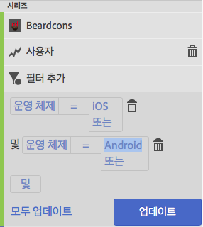

# Add filters to reports{#add-filters-to-reports}

이 정보는 필터(세그먼트)를 추가하여 기본 제공된 보고서를 사용자 지정하는 데 도움이 됩니다.

>[!IMPORTANT]
>
>Mobile app metrics are also available in marketing reports &amp; analytics, ad hoc analysis, data warehouse, and other Analytics reporting interfaces. Adobe Mobile에서 분류 또는 보고서 유형을 사용할 수 없는 경우 다른 보고 인터페이스를 사용하여 생성할 수 있습니다.

이 예에서는 **[!UICONTROL 사용자 및 세션]보고서를 사용자 지정하지만, 지침은 모든 보고서에 적용됩니다.**

1. Open your app and click **[!UICONTROL Usage]** &gt; **[!UICONTROL Users &amp; Sessions]**.

   

   이 보고서에서는 앱 사용자에 대한 전체 시간별 보기를 제공합니다. 하지만, 이 앱의 iOS와 Android 버전 모두에 대한 지표는 동일한 보고서 세트에서 수집됩니다. 사용자 지정 필터를 사용자 지표에 추가하여 모바일 OS별로 사용자를 세그멘트화할 수 있습니다.

1. Click **[!UICONTROL Customize]**.

   

1. Under **[!UICONTROL Users]**, click **[!UICONTROL Add Filter]** and click **[!UICONTROL Add Rule]**.

1. Select **[!UICONTROL Operating Systems]**, and from the drop-down list, and select **[!UICONTROL iOS]**.

   

   Android를 필터로 추가하려면 이 단계를 반복해야 합니다.

1. Click **[!UICONTROL And]**, select **[!UICONTROL Operating Systems]** from the drop-down list, and select **[!UICONTROL Android]**.

   이제 필터가 다음의 예처럼 표시되어야 합니다.

   

1. **[!UICONTROL 업데이트를 클릭합니다]**.
1. To regenerate the report, click **[!UICONTROL Run]**.

   이제 이 보고서에 운영 체제별로 분류된 사용자가 표시됩니다. 보고서 제목은 보고서에 적용된 필터와 일치하도록 변경되었습니다.

   

   이 보고서를 더 사용자 지정할 수 있습니다. From iOS 8.3, you can add the First Launches metric with an iOS 8.3 operating system version filter to see how many iOS 8.3 customers upgraded their apps and performed a first launch.
1. Under **[!UICONTROL First Launches]**, click **[!UICONTROL Add Filter]**, click **[!UICONTROL Add Rule]**, select **[!UICONTROL Operating Systems]** from the drop-down list, and select **[!UICONTROL iOS]**.
1. Click **[!UICONTROL And]**, select **[!UICONTROL Operating System Versions]** from the drop-down list, and select **[!UICONTROL iOS 8.3]**.

   이제 필터가 다음의 예처럼 표시되어야 합니다.

   

1. Click **[!UICONTROL Update]** and **[!UICONTROL Run]**.

   이제 이 보고서에 앱을 처음 실행한 iOS 8.3 사용자가 표시됩니다.

   

   시간을 내어 보고서 사용자 지정 메뉴에서 여러 옵션을 테스트해 보고, 자주 사용하는 항목을 책갈피에 추가하십시오. Adobe Mobile의 보고서 URL이 작동하며 이메일로 보내거나 즐겨찾기에 추가할 수 있습니다.
