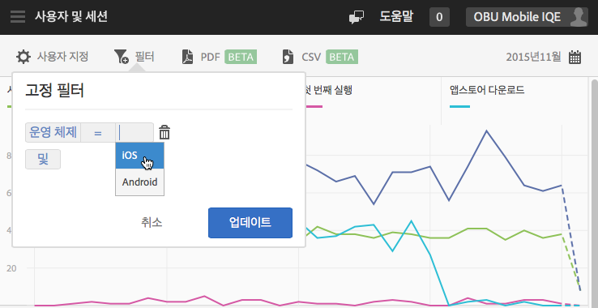

# 고정 필터 추가{#add-sticky-filter}

다른 보고서에 적용되는 필터를 생성하여 세그먼트가 모든 모바일 보고서에서 어떻게 작동하는지 확인할 수 있습니다. 고정 필터를 사용하면 경로 지정 외의 모든 보고서에 적용되는 필터를 정의할 수 있습니다.

다음 예에서는 iOS 및 Android 운영 체제에 대한 고정 필터를 **[!UICONTROL 사용자 및 세션]** 보고서에 추가하지만 모든 보고서와 지표에 지침이 적용됩니다.

1. Adobe Mobile의 보고서 상단에 있는 **[!UICONTROL 필터]** 아이콘을 클릭합니다.

   

1. 고정 필터 대화 상자에서 **[!UICONTROL 규칙 추가]**&#x200B;를 클릭하고, **[!UICONTROL 운영 체제]**&#x200B;를 선택한 다음, 드롭다운 목록에서 **[!UICONTROL iOS]**&#x200B;를 선택합니다.

   Android를 필터로 추가하려면 이 단계를 반복합니다.

   

1. **[!UICONTROL 및]**&#x200B;을 클릭하고, **[!UICONTROL 운영 체제]**&#x200B;를 선택한 다음 드롭다운 목록에서 **[!UICONTROL Android]**&#x200B;를 선택합니다.

   이제 필터가 다음의 예처럼 표시되어야 합니다.

   

1. **[!UICONTROL 업데이트]** 및 **[!UICONTROL 실행]**&#x200B;을 클릭합니다.
