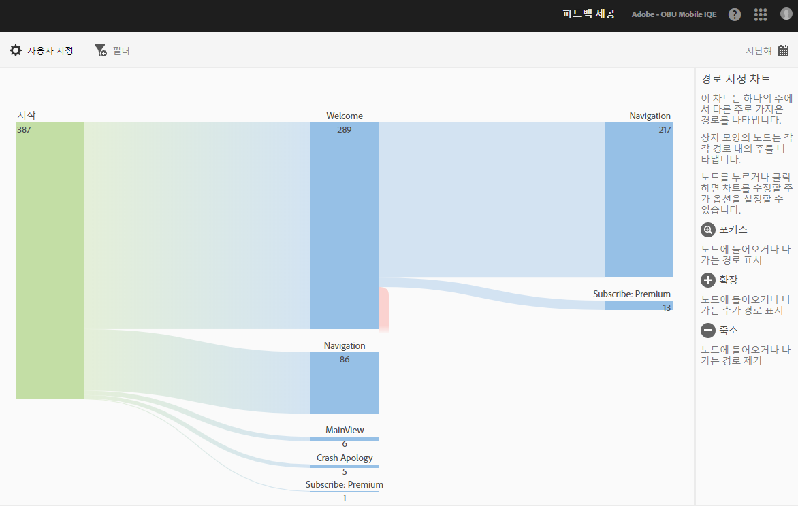

# 경로 보기 보고서 {#view-paths}

경로 분석을 기반으로 하는 **[!UICONTROL 경로 보기]** 보고서는 앱의 상태 간에 이동된 경로를 나타내는 경로 지정 차트를 표시합니다.

>[!TIP]
>
>**[!UICONTROL 경로 보기]** 및 **[!UICONTROL 작업 보기]** 보고서는 둘 다 경로 지정 보고서이므로 유사합니다. **[!UICONTROL 경로 보기]** 보고서를 사용하면 사용자가 앱의 한 화면에서 다음 화면으로 이동하는 방식을 알 수 있습니다. **[!UICONTROL 작업 보기]** 보고서는 사용자가 앱에서 수행하는 클릭, 선택, 크기 조정 등과 같은 작업 및 이벤트 순서를 표시합니다. 단계 보고서를 사용하여 한 보고서에 탐색과 작업을 결합할 수 있습니다. 자세한 내용은 [단계](/help/using/usage/reports-funnel.md)를 참조하십시오.

상자 모양의 각 노드는 앱에서 사용자 경로에 있는 상태를 나타냅니다. 예를 들어 위의 그림에서 맨 위 노드는 앱을 시작하고 기본 보기로 이동한 사용자의 수를 나타냅니다.

노드를 클릭하여 차트를 수정할 수 있는 추가 옵션을 제공하면 **[!UICONTROL 포커스]** 또는 **[!UICONTROL 확장]**&#x200B;과 같은 추가 옵션이 표시됩니다. 예를 들어, 맨 위 노드에서 **[!UICONTROL 기본 보기]** 상태를 클릭하면, **[!UICONTROL 포커스]** 및 **[!UICONTROL 확장]** 아이콘이 표시됩니다.

보기를 확장하려면 **[!UICONTROL +]** 아이콘을 클릭하여 노드에서 들어오거나 나가는 추가 경로를 표시합니다. 아래 그림에서 상태 1은 앱 시작을 상태 2는 앱의 기본 페이지 보기를 나타내며 상태 3에는 사용자가 사용한 다음 경로가 포함됩니다.

* 카메라 롤로 이동
* 항목 선택기로 이동
* 카메라로 이동
* 항목 정보 페이지로 이동

노드를 격리하고 선택한 노드에서 들어오고 나가는 경로를 표시하려면 을 클릭합니다. 아래 그림에서는 앱의 기본 보기를 보고 있던 사용자보다 다음 경로가 우선합니다.

* 항목 정보
* 항목 선택기
* 카메라 롤
* 카메라

여러 노드에 초점을 맞추거나 확장하여 사용자가 앱에서 선택하는 경로에 대해 자세히 볼 수 있습니다. 예:

이 보고서에 대해 다음 옵션을 구성할 수 있습니다.

* **[!UICONTROL 기간]**
****&#x200B;달력 아이콘을 클릭하여 사용자 지정 기간을 선택하거나 드롭다운 목록에서 사전 설정된 기간을 선택합니다.
* **[!UICONTROL 사용자 지정]**
**[!UICONTROL 표시 기준]** 옵션 변경, 지표 및 필터 추가, 시리즈(지표) 추가 등을 통해 보고서를 사용자 지정합니다. 자세한 내용은 [보고서 사용자 지정](/help/using/usage/reports-customize/reports-customize.md)을 참조하십시오.
* **[!UICONTROL 필터]**
**[!UICONTROL 필터]**&#x200B;를 클릭하면 다른 보고서에 적용되는 필터를 생성하여 세그먼트가 모든 모바일 보고서에서 어떻게 작동하는지 확인할 수 있습니다. 고정 필터를 사용하면 경로 지정 외의 모든 보고서에 적용되는 필터를 정의할 수 있습니다. 자세한 내용은 [고정 필터 추가](/help/using/usage/reports-customize/t-sticky-filter.md)를 참조하십시오.
* **[!UICONTROL 다운로드]**
**[!UICONTROL PDF]** 또는 **[!UICONTROL CSV]**&#x200B;를 클릭하여 문서를 다운로드하거나 열고, Mobile Services에 대한 액세스 권한이 없는 사용자와 공유하거나 프레젠테이션의 파일을 사용할 수 있습니다.
